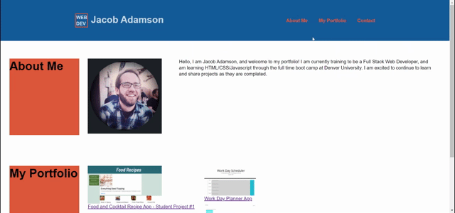

# My Portfolio

Our second assignment was to build a functional website from scratch using HTML and CSS, combining knowledge we've learned in both. The website is a portfolio for my work that I will continue to add projects to, as class progresses.

## Tech used

    *HTML/CSS
    *Git
    *VS Code

## Screenshots of Working Website

## Links

- https://github.com/JKLA13/my-portfolio
- https://jkla13.github.io/my-portfolio/
